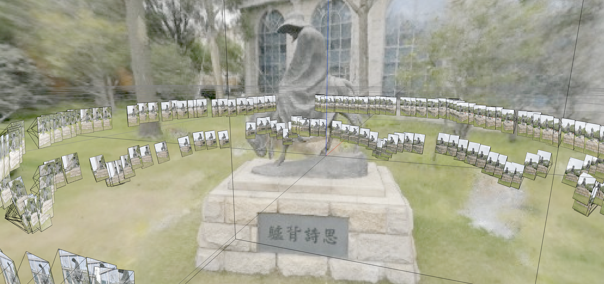
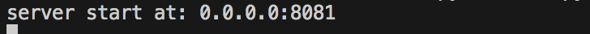

# <div align = "center">EDREServer</div>

<a href="#Introduction-介绍">Introduction</a>

<a href="#Quickstart-启动项目">Quickstart</a>

<a href="#Project details-项目细节">Project details</a>

<a href="#For develop-开发">For develop</a>

## Introduction-介绍

本项目是基于Flask框架的web后端应用程序，实现了获取图像进行训练和渲染的功能，本文将介绍如何设置和运行这个程序。



本项目主要基于了[NerfStudio](https://github.com/nerfstudio-project/nerfstudio)项目的[2.0](https://github.com/nerfstudio-project/nerfstudio/tree/v0.2.0)版本进行实现，使用了其中nerfstudio以及scripts包，实现了获取前端请求以进行实现colmap，训练，渲染等功能。

对于数据库方面使用了Mysql数据库进行对每一个项目的管理，对文件包的管理。

## Quickstart-启动项目

#### 1.Installation-配置环境

##### 所需硬件基础

本后端需要英伟达显卡，同时需要安装CUDA，建议CUDA版本为11.3或者11.7

##### 创建环境

该项目所需`python>=3.7`，建议使用conda进行管理，基于conda创建环境如下：

```
conda create --name nsedre -y python=3.8
conda activate nsedre
python -m pip install --upgrade pip
```

##### 安装colmap

对于linux系统，安装的方法主要有以下3种：

***推荐**：1.使用colmap源码安装，前往[colmap](https://colmap.github.io/install.html#)获取详细步骤。

2.使用`sudo apt install colmap`进行安装

3.使用VKPG进行安装：

```
git clone https://github.com/microsoft/vcpkg
cd vcpkg
./bootstrap-vcpkg.sh
./vcpkg install colmap[cuda]:x64-linux
```

*上述方法都是在linux系统下进行安装，如需更多系统下的安装可前往[InstallingColmap](https://docs.nerf.studio/en/latest/quickstart/custom_dataset.html#installing-colmap)获取更多详细内容。

##### 安装torch和tiny-cuda-nn

For CUDA 11.3:

```
pip install torch==1.12.1+cu113 torchvision==0.13.1+cu113 -f https://download.pytorch.org/whl/torch_stable.html
pip install ninja git+https://github.com/NVlabs/tiny-cuda-nn/#subdirectory=bindings/torch
```

For CUDA 11.7:

```
pip install torch==1.13.1 torchvision functorch --extra-index-url https://download.pytorch.org/whl/cu117
pip install ninja git+https://github.com/NVlabs/tiny-cuda-nn/#subdirectory=bindings/torch
```

对于tiny-cuda-nn的安装，如果上述指令无法获取，则使用从[tiny-cuda-nn](https://github.com/NVlabs/tiny-cuda-nn/)仓库获取文件安装：

```
git clone --recursive https://github.com/nvlabs/tiny-cuda-nn
cd tiny-cuda-nn
cd bindings/torch
```

可选择使用以下几个命令进行安装：

```
python setup.py install
```

或者

```
pip install -e .
```

或者

```
pip install .
```

##### 安装其他依赖包

```
pip install -r requirements.txt
```

#### 2.Start-服务开启

运行一下命令实现服务的开启

```
python run.py
```



出现该提示则说明服务成功运行

## Project details-项目细节

#### 1.framework-整体框架


EDREserver/run.py即为本项目启动Flask服务的入口，通过调用EDREserver/app/create_app.py配置flask，其中的EDREserver/app/init.py用于保存创建的数据库以及flask对象。

##### EDREserver/app/api

主要的接口实现部分，即获取前端的请求，根据请求进行处理。

##### EDREserver/app/config

项目以及数据库的配置。

##### EDREserver/app/models

数据库表的映射，用于连接数据库

##### EDREserver/app/nerfstudio

使用的nerfstudio的文件，该部分即包含了数据处理、训练、渲染的实际代码

##### EDREserver/app/scripts

使用的nerfstudio的文件，该部分为本项目api中所调用实际运行脚本

##### EDREserver/app/sql

项目数据库文件，主要进行数据库的建表

#### 2.API-接口

目前已经实现的接口如下表：

| 请求                  | 方法 | 参数                    | 备注                                    |
| --------------------- | ---- | ----------------------- | --------------------------------------- |
| api/selecttest        | GET  | 无                      | 用于临时测试数据库查找                  |
| api/addtest           | POST | ProjectList             | 临时测试数据库写入记录                  |
| api/getAllProjects    | GET  | 无                      | 从数据库获取所有项目                    |
| api/startTrain        | POST | title,avatar,imageFiles | 获取传入的封面图片、训练数据、对应title |
| api/viewer            | POST | title                   | 获取传入title进行前端渲染               |
| api/viewerClose       | POST | title                   | 关闭对应title的渲染进程                 |
| api/createProject     | POST | title, avatar,datetime  | 创建项目，即数据库创建记录              |
| api/uploadImgs        | POST | title,imageFiles        | 对创建好的项目传入数据                  |
| api/runColmap         | POST | title                   | 运行Colmap                              |
| api/runTrain          | POST | title                   | 开始训练                                |
| api/runColmapAndTrain | POST | title                   | 合并colmap以及训练的过程                |

##### 整体流程

目前所使用的接口主要为api/getAllProjects，api/viewer，api/viewerClose，api/createProject，api/uploadImgs，api/runColmapAndTrain，对于创建一个新项目并在前端进行渲染的流程为：

api/createProject->api/uploadImgs->api/runColmapAndTrain->api/viewer

#### 3.数据库设计


目前title被标明为UNIQUE，唯一指明当前的模型，表中state指明当前创建的模型的状态，0，1，2分别代表colmap中，训练中，训练结束

## For develop-开发

##### colmap

目前运行colmap是调用的EDREserver/app/nerfstudio/process_data/images_to_nerstudio_dataset.py文件，创建该实例进行colmap的运行，目前封装在colmapthread函数中，对应接口进行线程调用

##### 模型训练

使用的文件为EDREserver/app/nerfstudio/engine/trainer.py，创建Trianer类对象，调用相应函数进行训练

##### 前端渲染

目前对于前端渲染，使用调包后台运行的方式会产生进程与线程的冲突，目前所使用的方法为通过subprocess进行命令运行，目前对于前端端口的使用情况为简单通过一个字典进行存储，端口号为键，对应使用的进程号为值，开启渲染就会通过对字典查询，若端口空闲，则进行使用。

渲染调包运行的介绍：渲染对应的文件为EDREserver/app/scripts/viewer/run_viewer.py，使用的类为RunViewer

##### 项目完善

目前接口的返回值无论是否正确都是200，目前代码有异常处理的实现，但还未进行异常返回的实现，即错误时返回非200的返回码